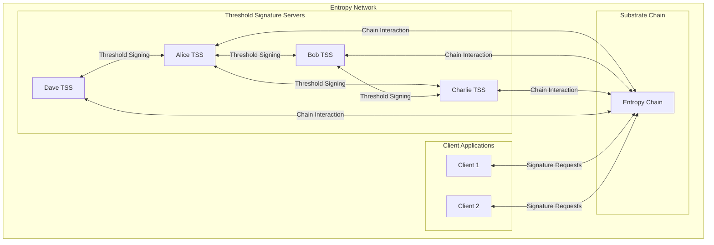
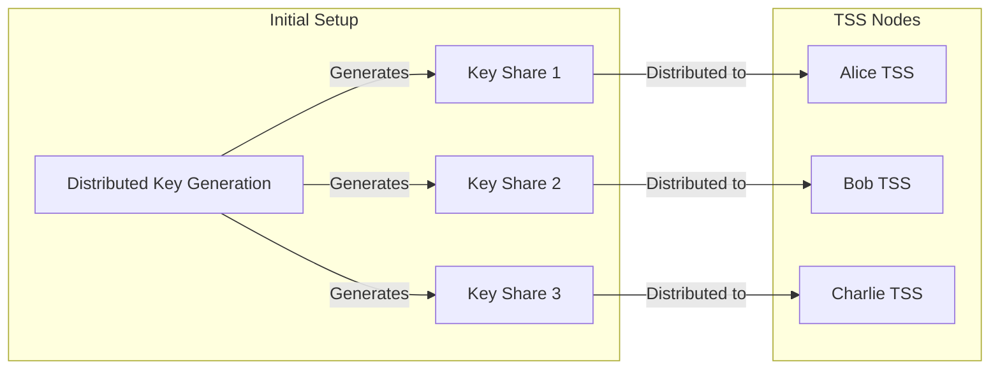
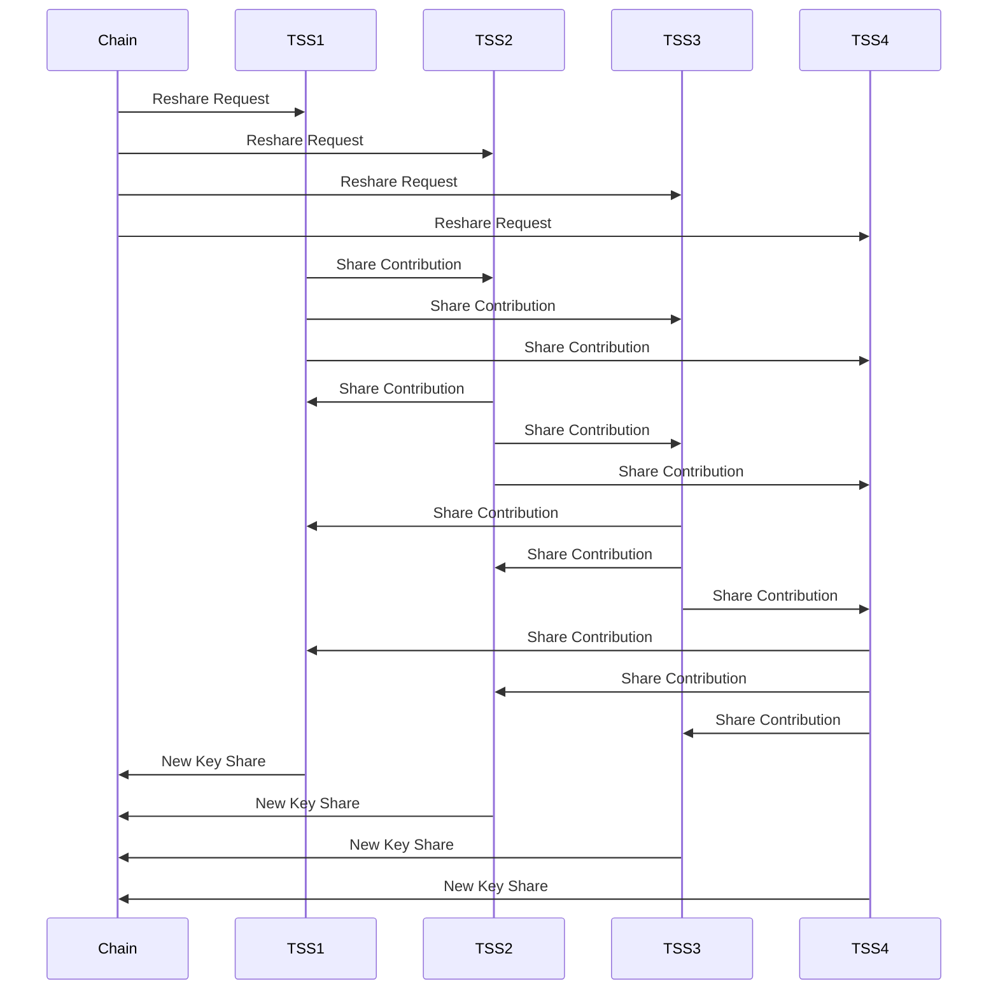
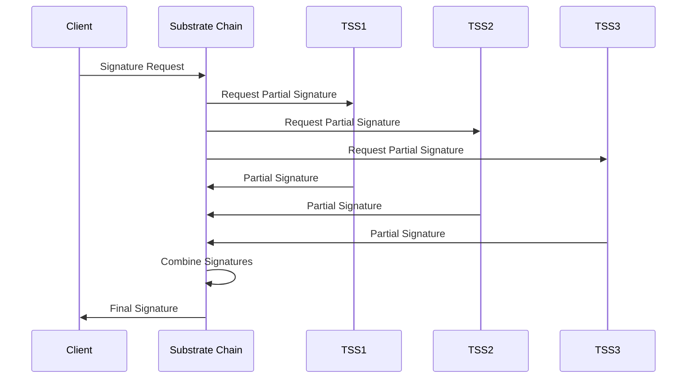
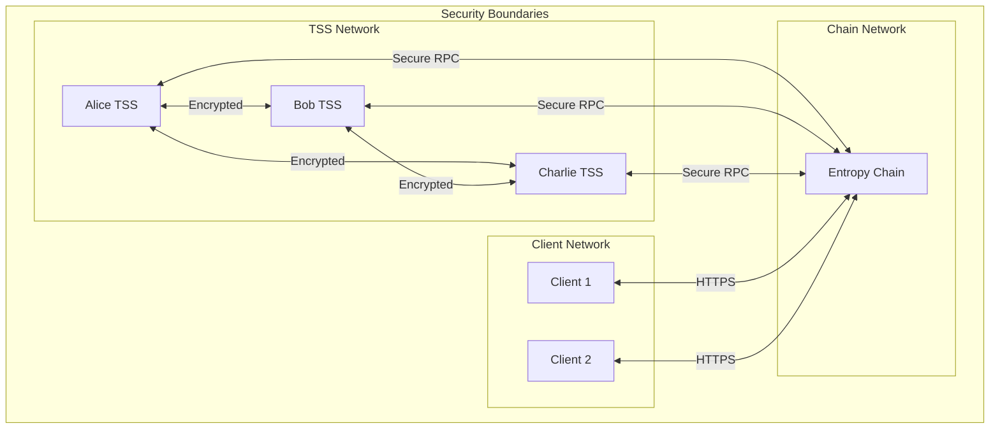
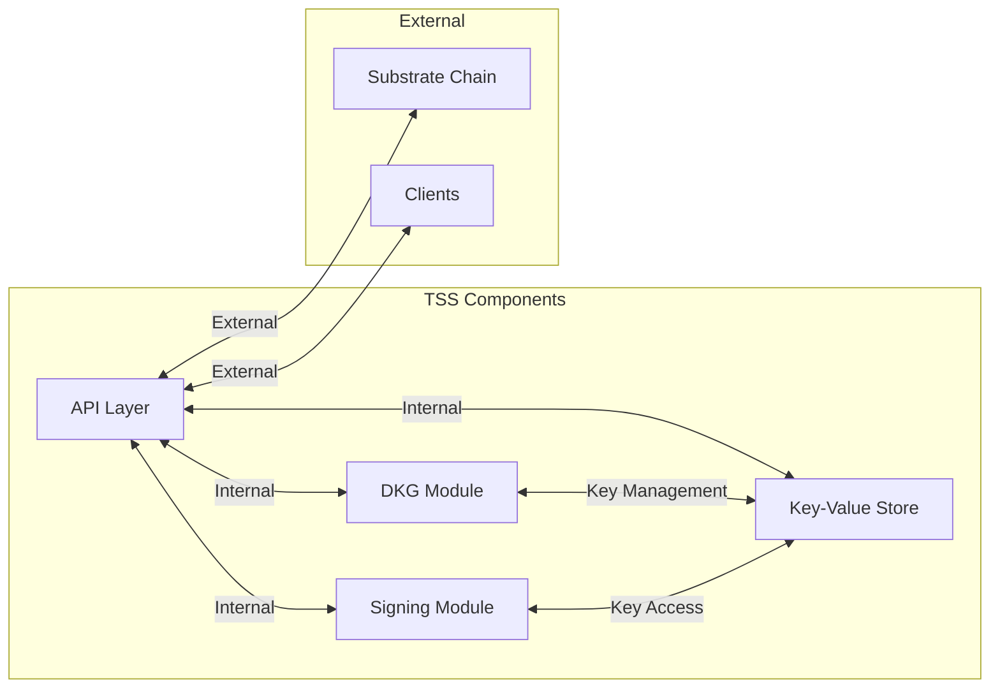

# Entropy Network Architecture

This document provides a high-level overview of the Entropy network architecture using diagrams.

## System Overview

## Key Share Distribution

## Reshare Process

## Signature Generation Process

## Network Security Model

## Component Interaction

