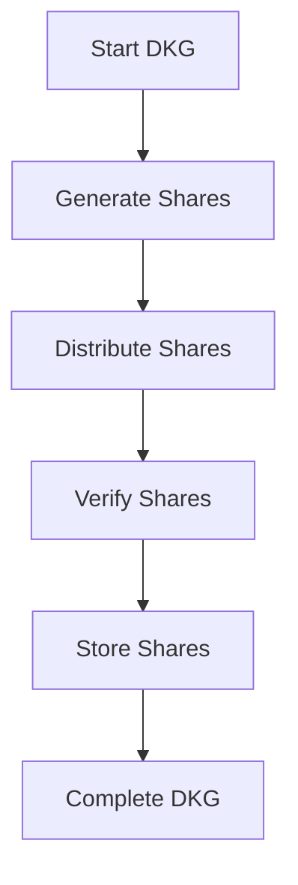
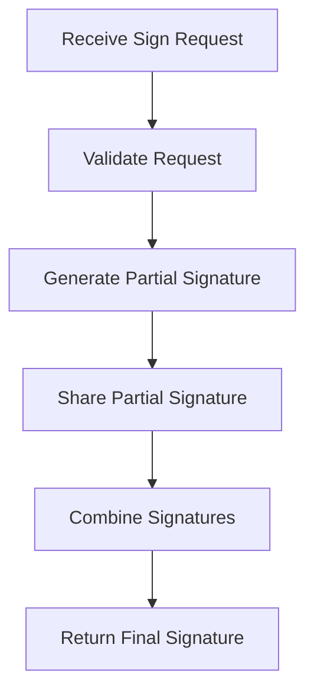
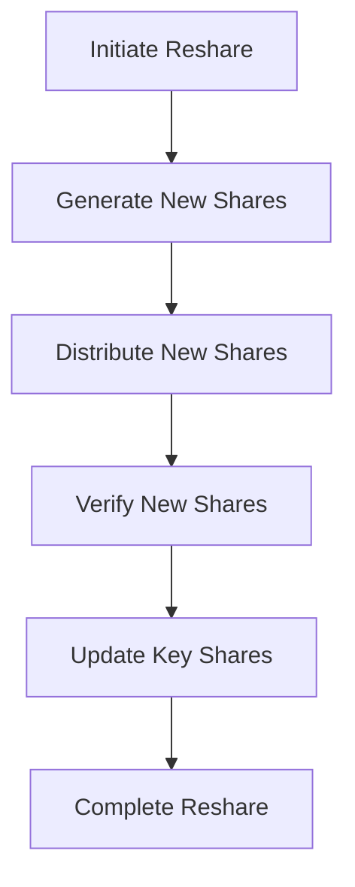
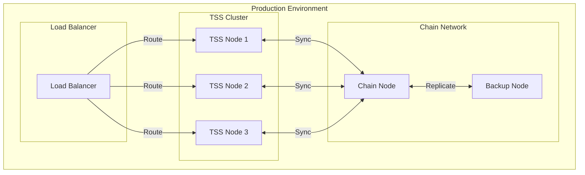

# Entropy Technical Architecture

This document provides a detailed technical overview of the Entropy system architecture.

## System Components

### Threshold Signature Servers (TSS)

The TSS nodes are the core components of the Entropy network. Each TSS node:

1. **Key Management**
   - Stores key shares securely
   - Participates in distributed key generation (DKG)
   - Handles key resharing operations

2. **Signature Generation**
   - Generates partial signatures
   - Combines partial signatures into final signatures
   - Validates signature requests

3. **Network Communication**
   - Maintains secure connections with other TSS nodes
   - Communicates with the Substrate chain
   - Handles client requests

### Substrate Chain

The Entropy chain is built on Substrate and provides:

1. **Chain State Management**
   - Tracks TSS node status
   - Manages key share distribution
   - Handles resharing operations

2. **Transaction Processing**
   - Processes signature requests
   - Validates transactions
   - Manages program storage

3. **Security**
   - Enforces access control
   - Manages permissions
   - Handles consensus

### Client Applications

Clients interact with the system through:

1. **API Layer**
   - RESTful endpoints
   - WebSocket connections
   - RPC interfaces

2. **Security**
   - Authentication
   - Authorization
   - Request validation

## Key Technical Features

### Distributed Key Generation (DKG)



### Threshold Signing Process



### Resharing Protocol



## Security Considerations

### Key Share Protection

- Key shares are never stored in plain text
- Each TSS node maintains its own secure storage
- Access to key shares is strictly controlled

### Network Security

- All TSS node communication is encrypted
- Chain communication uses secure RPC
- Client communication uses HTTPS

### Access Control

- Role-based access control
- Permission management
- Request validation

## Performance Considerations

### Scalability

- Horizontal scaling of TSS nodes
- Efficient signature combination
- Optimized network communication

### Reliability

- Fault tolerance
- Automatic recovery
- Backup mechanisms

### Latency

- Optimized signature generation
- Efficient network protocols
- Caching mechanisms

## Development Guidelines

### Code Organization

```
entropy-core/
├── crates/
│   ├── protocol/         # Core protocol implementation
│   ├── threshold-signature-server/  # TSS implementation
│   └── shared/          # Shared utilities
├── runtime/             # Substrate runtime
└── pallets/            # Custom Substrate pallets
```

### Testing Strategy

1. **Unit Tests**
   - Component-level testing
   - Mock dependencies
   - Fast execution

2. **Integration Tests**
   - End-to-end testing
   - Network simulation
   - Real-world scenarios

3. **Security Tests**
   - Penetration testing
   - Vulnerability scanning
   - Security audits

## Deployment Architecture

